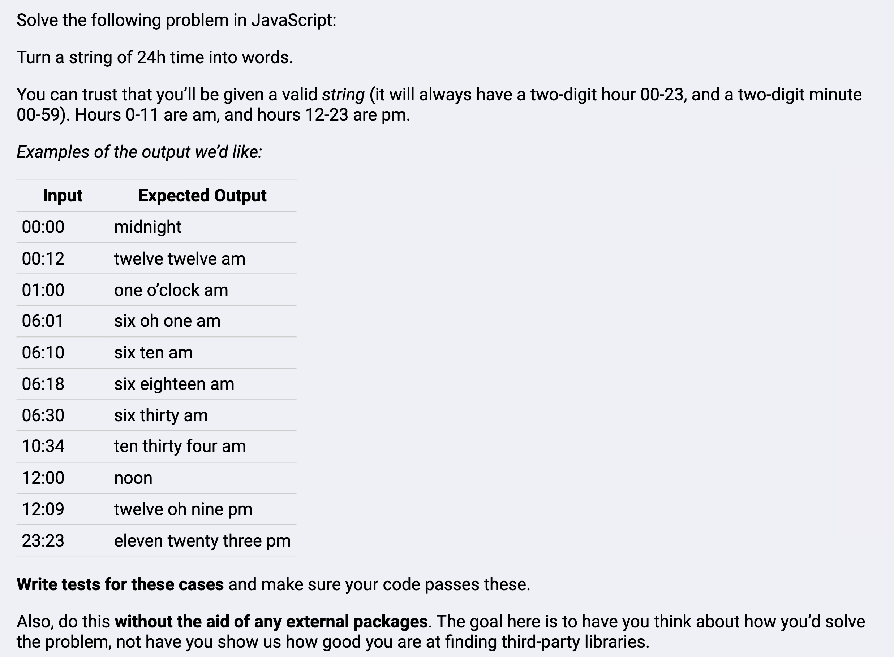
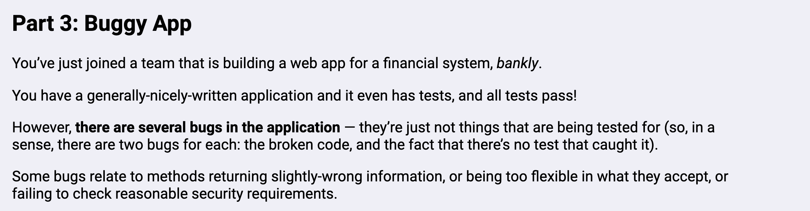
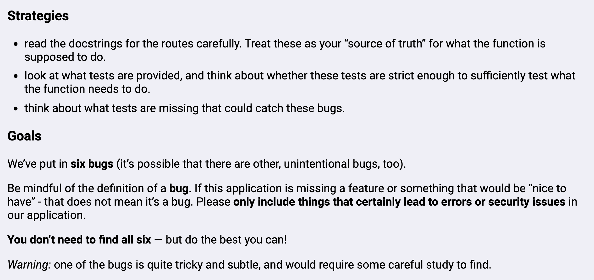

# This repo contains two applications: /bankly-app and /timeword-app.

## Timeword app turns a string of 24h time into words.

    - This was a challenge where I needed to achive the following requirements:

## Bankly-app includes fixes to six bugs that I found in an already-built application.

    - Instructions are here:

